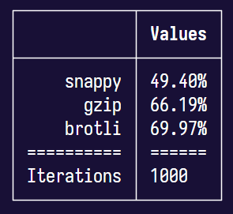

# compression

This is a simple project illustrating the average percentage of bytes saved when compressing text data with various algorithms.

By default, it is configured to run averages on 1000 iterations on roughly 16kb of generated JSON data.

To install dependencies:

```bash
bun install
```

To run:

```bash
bun run index.ts
```

After running the script above, you should see similar results showing brotli is roughly 70% more efficient at compressing text data than gzip or snappy;


